# Dreame Vacuum Multi-Floor Button Control

[](https://github.com/errormastern/Dreame_Multifloor_Button_Control/releases)
[](https://www.home-assistant.io/)
[](LICENSE)
[](https://github.com/errormastern/Dreame_Multifloor_Button_Control)

Multi-floor control for Dreame vacuum cleaners via button triggers (MQTT, Device, State, or Event)

## Features

- **Zero Configuration**: Select vacuum entity, all else auto-detected
- **Flexible Triggers**: MQTT, Device, State, or Event per function
- **Intelligent Start/Pause**: Base station detection and adaptive behavior
- **Smart Undocking**: Configurable delay after leaving station for easier robot pickup
- **Room/Segment Cleaning**: Configurable repeat counts
- **Self-Clean Automation**: Automatically enabled/disabled based on current map
- **Map Switching**: Up to 3 maps
- **Debug Mode**: Persistent notifications for troubleshooting

## Requirements

- Home Assistant ≥ 2024.10.0
- [Dreame Vacuum Integration](https://github.com/Tasshack/dreame-vacuum) ≥ v2.0.0b19
- At least one saved map configured in robot
- Button device (optional: Zigbee2MQTT switch or any Home Assistant trigger)

## Installation

### Via Import Button

[](https://my.home-assistant.io/redirect/blueprint_import/?blueprint_url=https://github.com/errormastern/Dreame_Multifloor_Button_Control/raw/main/vacuum_control.yaml)

### Manual Import

1. Navigate to **Settings** → **Automations & Scenes** → **Blueprints**
2. Click **Import Blueprint**
3. Enter URL: `https://github.com/errormastern/Dreame_Multifloor_Button_Control/raw/main/vacuum_control.yaml`
4. Click **Preview** → **Import**

## Configuration

### Basic Setup

1. Create automation from blueprint
2. Select your vacuum entity (e.g., `vacuum.dreame_x10`)
3. Configure triggers for desired functions (see below)
4. Save automation

All entities (status, mode, map, camera) are automatically detected from the vacuum entity.

### Function Triggers

Configure triggers for each function you want to use:

| Function | Trigger ID | Default MQTT/Device Action | Description |
|----------|------------|----------------------------|-------------|
| Sweep Only | `fn_sweep` | `1_single` | Set cleaning mode to sweep only |
| Sweep + Mop | `fn_mop` | `2_single` | Set cleaning mode to sweep and mop |
| Start/Pause/Resume | `fn_start` | `3_single` | Smart start/pause/resume logic |
| Map 1 Switch | `fn_map1` | `4_single` | Switch to Map 1 |
| Map 2 Switch | `fn_map2` | `5_single` | Switch to Map 2 |
| Map 3 Switch | `fn_map3` | `6_single` | Switch to Map 3 |

#### Trigger Examples

**MQTT Trigger** (Zigbee2MQTT button):
```yaml
trigger: mqtt
topic: zigbee2mqtt/vacuum_button
payload: '{"action": "1_single"}'
```

**Device Trigger** (Zigbee2MQTT device):
```yaml
trigger: device
device_id: your_device_id
type: action
subtype: 1_single
```

**State Trigger** (any entity):
```yaml
trigger: state
entity_id: input_button.sweep_only
```

**⚠️ Important:** MQTT/Device triggers auto-detect action values (`1_single`, `2_single`, etc.). For State/Event triggers, manually set Trigger ID in trigger advanced options (e.g., `fn_sweep`, `fn_mop`, `fn_start`, `fn_map1`, `fn_map2`, `fn_map3`).

## Functions

### Mode Switching

**Sweep Only** and **Sweep + Mop** functions set the cleaning mode via `select.{robot}_cleaning_mode` entity.

Default values:
- Sweep Only: `sweeping`
- Sweep + Mop: `sweeping_and_mopping`

Adjust in **Cleaning Settings** if your robot uses different values.

### Smart Start/Pause/Resume

Adaptive behavior based on robot status:

| Robot Status | Action |
|--------------|--------|
| Idle | Start cleaning |
| Cleaning | Pause |
| Paused | Resume |

**Multi-Floor Logic:**
- **Base station map**: Starts cleaning immediately
- **Other maps**: Starts cleaning, waits for cleaning status, then pauses for manual transport

#### Flow Diagram

```mermaid
flowchart TD
    Start([▶️ Button Press: Smart Start]) --> GetStatus{Current<br/>Robot Status?}

    GetStatus -->|Cleaning| PauseAction[⏸️ Pause Robot]
    GetStatus -->|Paused| ResumeAction[▶️ Resume Robot]
    GetStatus -->|Idle| CheckMap{Current Map =<br/>Base Station Map?}

    PauseAction --> DebugPause{Debug?}
    ResumeAction --> DebugResume{Debug?}

    DebugPause -->|Yes| NotifyPause[📢 Robot Paused]
    DebugPause -->|No| EndPause([✅ Complete])
    DebugResume -->|Yes| NotifyResume[📢 Robot Resumed]
    DebugResume -->|No| EndResume([✅ Complete])

    NotifyPause --> EndPause
    NotifyResume --> EndResume

    CheckMap -->|Yes| StartBase[🏠 Start Cleaning on Base Map<br/>Self-Clean: ON]
    CheckMap -->|No| StartOther[🗺️ Start Cleaning on Other Map<br/>Self-Clean: OFF]

    StartBase --> EndBase([✅ Complete])
    StartOther --> WaitCleaning[⏳ Wait for Cleaning Status<br/>Timeout: 120s]

    WaitCleaning --> CheckMoisteningNeeded{Sweep+Mop<br/>Mode?}
    CheckMoisteningNeeded -->|Yes| WaitMoistening[💧 Wait for Moistening<br/>Timeout: 60s]
    CheckMoisteningNeeded -->|No| CheckUndocking

    WaitMoistening --> CheckUndocking{Charging State<br/>Sensor Available?}

    CheckUndocking -->|Yes| WaitUndock[🚪 Wait Until Robot Leaves Station<br/>Timeout: 30s]
    CheckUndocking -->|No| PauseTransport

    WaitUndock --> CheckDelay{Pause Delay<br/>> 0s?}
    CheckDelay -->|Yes| DelayAction[⏱️ Delay: 0.0-5.0s<br/>Default: 2.0s]
    CheckDelay -->|No| PauseTransport

    DelayAction --> PauseTransport[⏸️ Pause for Manual Transport]
    PauseTransport --> DisableSelfClean[🔧 Disable Self-Clean]
    DisableSelfClean --> EndTransport([✅ Ready for Transport])

    style Start fill:#4CAF50,stroke:#2E7D32,stroke-width:3px,color:#fff
    style PauseAction fill:#FF9800,stroke:#E65100,stroke-width:2px,color:#fff
    style ResumeAction fill:#2196F3,stroke:#1565C0,stroke-width:2px,color:#fff
    style StartBase fill:#4CAF50,stroke:#2E7D32,stroke-width:2px,color:#fff
    style StartOther fill:#9C27B0,stroke:#6A1B9A,stroke-width:2px,color:#fff
    style PauseTransport fill:#FF9800,stroke:#E65100,stroke-width:2px,color:#fff
    style EndTransport fill:#4CAF50,stroke:#2E7D32,stroke-width:3px,color:#fff
```



### Map Switching

Switches to selected map and adjusts self-clean switch:
- **Base station map**: Self-clean ON (returns to base after cleaning)
- **Other maps**: Self-clean OFF (manual transport required)

Supports up to 3 maps (Map 1, Map 2, Map 3). Maps are auto-detected from `camera.{robot}_map_1`, `_map_2`, `_map_3` entities. Custom map names are used if configured.

## Advanced Settings

### Pause & Transport

**Pause Delay After Undocking** (0.0-5.0s, default: 2.0s): Time to wait after robot leaves charging station before pausing for manual transport.

- **0.0s**: Immediate pause (robot may still be at station contacts)
- **2.0-3.0s**: Recommended for easier pickup (~10cm away from station)
- **5.0s**: Maximum delay (robot moves further from station)

This setting only applies when starting cleaning on non-base station maps. The robot will:
1. Start cleaning and moisten mops (if applicable)
2. Leave the charging station
3. Wait the configured delay time
4. Pause for manual transport

**Auto-Detection**: The blueprint automatically detects the `binary_sensor.{robot}_charging_state` entity. If not available, the robot pauses immediately after moistening.

### Segment Service

**Enabled** (default): Uses `dreame_vacuum.vacuum_clean_segment` with room/segment IDs and repeat counts.

**Disabled**: Falls back to `vacuum.start` for full map cleaning.

### Timeouts

- **Start Timeout** (120s): Max wait for robot to reach cleaning status after start command. Automation aborts on timeout.
- **Moistening Timeout** (60s): Max wait for mop moistening status. Continues on timeout (optional feature).

### Cleaning States

Comma-separated list of status values indicating active cleaning. Used for pause detection.

Default: `cleaning,returning,zone_cleaning,room_cleaning,sweeping,mopping,sweeping_and_mopping`

Only change if your robot reports different status values (check `sensor.{robot}_status`).

## Troubleshooting

### Automation Not Triggering

1. Verify at least one function has configured triggers
2. Check trigger configuration (topic, device_id, entity_id)
3. Enable **Debug Mode** to see trigger details in persistent notifications

### Robot Not Starting/Pausing

1. Verify entity auto-detection: Check `sensor.{robot}_status`, `select.{robot}_cleaning_mode`, `select.{robot}_selected_map`
2. Check cleaning mode values in **Cleaning Settings** match your robot's options (Developer Tools → States)
3. Review cleaning states configuration

### Segments Not Found

1. Verify `camera.{robot}_map` entity has `rooms` or `segments` attribute
2. Check robot is online and map is loaded
3. Disable **Use Segment Service** to use fallback `vacuum.start`

### Debug Mode

Enable in **Advanced Settings** to show detailed information on every trigger:
- Triggered function and trigger details
- Robot status, map, and mode
- Auto-detected maps and base station
- Available rooms/segments

## Automation Mode

**Mode:** `queued` (max: 10)

Processes button presses sequentially without cancellation. Required for Zigbee2MQTT buttons that send press + release events.

## Status

This blueprint is in **alpha testing** (v0.2.8). Core functionality is implemented and tested with Dreame X10+. Feedback and bug reports welcome via GitHub Issues.

## Links

- **Repository**: https://github.com/errormastern/Dreame_Multifloor_Button_Control
- **Dreame Vacuum Integration**: https://github.com/Tasshack/dreame-vacuum
- **Zigbee2MQTT**: https://www.zigbee2mqtt.io

## License

MIT License - Free to use and modify.