# Dreame Vacuum - Multifloor Control

[](https://github.com/errormastern/dreame-multifloor-control/releases)
[](https://www.home-assistant.io/)
[](LICENSE)
[](https://github.com/errormastern/dreame-multifloor-control)

> **The Problem**: Cleaning floors without a base station requires tedious manual steps: switching maps, starting cleaning, waiting, pausing, transporting upstairs, resuming... Time-based automation makes it worse - you must be home to manually transport the robot.
>
> **The Solution**: This blueprint combines schedule integration with notification-based preparation. Maps with base station clean automatically at scheduled times. Maps without base station send notifications with action buttons - you start preparation when ready, then receive pickup notification when robot is paused. Full automation meets real-world flexibility.

## Features

### Core Functionality
- **Zero configuration** - Select vacuum entity, everything else auto-detected
- **Per-map schedules** - Separate sweep/mop schedules for each map (3 maps supported)
- **Automatic base station detection** - Maps with base station start automatically
- **Notification workflow** - Maps without base station send preparation notifications with action buttons
- **Flexible triggers** - Any Home Assistant trigger (buttons, schedules, presence, etc.) for manual control
- **Intelligent preparation workflow** - Automatic mop moistening and tank filling for non-base station maps
- **Smart undocking** - Configurable delay for optimal transport position
- **Segment cleaning** - Room-based cleaning with configurable repeats per map
- **Debug mode** - Timing measurements and step-by-step execution tracking

### Schedule Integration
- **Per-map sweep + mop schedules** - 6 schedules total (sweep/mop for each of 3 maps)
- **Conflict detection** - Only 1 schedule runs at a time (silent abort on conflict)
- **Smart automation**:
  - Maps **with** base station → Start cleaning automatically at scheduled time
  - Maps **without** base station → Send notification with "Prepare Robot" button
- **Template-based notifications** - Customize title/message with 9 available variables
- **Action buttons** - "Prepare Robot", "Skip Cleaning", "Start Cleaning", "Cancel Cleaning"
- **Repeat notifications** - Configurable repeat count (1-3) and interval (0-240 min)

## Requirements

- Home Assistant ≥ 2024.10.0
- [Dreame Vacuum Integration](https://github.com/Tasshack/dreame-vacuum) ≥ v2.0.0b19
- At least one saved map configured in robot
- Optional: Schedule Helpers for time-based automation

## Installation

[](https://my.home-assistant.io/redirect/blueprint_import/?blueprint_url=https://github.com/errormastern/dreame-multifloor-control/raw/main/vacuum_control.yaml)

Or manually: **Settings** → **Automations & Scenes** → **Blueprints** → **Import Blueprint** → Paste URL above

## Quick Start

1. Create automation from blueprint
2. Select your vacuum entity (e.g., `vacuum.dreame_x10`)
3. Add triggers for functions you need (see table below)
4. Save and test

All related entities (status, mode, map, camera) are auto-detected.

## Schedule Setup (v0.3.3+)

Configure time-based automated cleaning with per-map schedules.

### Step 1: Create Schedule Helpers

1. Go to **Settings** → **Devices & Services** → **Helpers**
2. Click **Create Helper** → **Schedule**
3. Create schedules as needed:
   - `Map 1 Sweep Schedule` (e.g., Mon-Fri 09:00)
   - `Map 1 Mop Schedule` (e.g., Wed 14:00)
   - `Map 2 Sweep Schedule` (e.g., Tue/Thu 10:00)
   - etc.

### Step 2: Assign Schedules to Maps

1. Edit your blueprint automation
2. Expand **Map 1/2/3 Configuration** sections
3. Select schedule entities:
   - **Sweep Schedule**: Schedule for sweep-only cleaning
   - **Mop Schedule**: Schedule for sweep+mop cleaning
4. Leave empty if you don't want schedules for that map
5. Save

### Step 3: Configure Notifications (Optional)

Only needed for maps **without** base station:

1. Expand **Scheduled Cleaning Notifications**
2. Enable notifications
3. Select notification service (e.g., `notify.mobile_app_iphone`)
4. Customize title/message with template variables:
   - `{{ robot_name }}` - Robot name
   - `{{ map_name }}` - Target map
   - `{{ cleaning_mode_display }}` - "Sweep Only" or "Sweep + Mop"
   - See full variable list in blueprint description
5. Configure repeat settings (optional)
6. Repeat for **Pickup Notifications**
7. Save

### How It Works

**Maps WITH base station:**
- Schedule triggers → Robot starts cleaning automatically
- No notifications sent

**Maps WITHOUT base station:**
1. Schedule triggers → "Scheduled Cleaning Ready" notification
2. Press "Prepare Robot" → Robot starts cleaning, then auto-pauses
3. "Robot Ready for Transport" notification → Pick up robot
4. Press "Start Cleaning" after transport → Robot resumes cleaning

**Conflict Detection:**
- Only 1 schedule can run at a time
- If robot is already cleaning, new schedules abort silently

## Manual Control Functions

Each function can use any Home Assistant trigger. For **MQTT/Device triggers** (e.g., Zigbee2MQTT buttons), action values are auto-detected. For **State/Event triggers**, set the Trigger ID manually in advanced options.

| Function | Trigger ID | Description |
|----------|------------|-------------|
| Sweep Only Mode | `fn_sweep` | Set cleaning mode to sweep-only |
| Sweep + Mop Mode | `fn_mop` | Set cleaning mode to sweep and mop |
| Smart Start/Pause/Resume | `fn_start` | Intelligent workflow based on robot status |
| Map 1 / Map 2 / Map 3 | `fn_map1` / `fn_map2` / `fn_map3` | Switch to selected map |

### Trigger Examples

```yaml
# Physical button (e.g., Zigbee2MQTT)
trigger: mqtt
topic: zigbee2mqtt/vacuum_button

# Presence (start when everyone leaves)
trigger: state
entity_id: group.all_persons
to: "not_home"

# Input button (dashboard control)
trigger: state
entity_id: input_button.vacuum_start
# ⚠️ Set Trigger ID to "fn_start" in advanced options
```

**Note:** Time-based triggers are now configured via Schedule Helpers (see [Schedule Setup](#schedule-setup-v033) above), not as manual triggers.

## Smart Start Workflow

The core function adapts to robot status and location:

| Robot Status | Current Map | Action |
|--------------|-------------|--------|
| **Cleaning** | Any | Pause immediately |
| **Paused** | Any | Resume cleaning |
| **Idle** | Base station map | Start cleaning (with self-clean enabled) |
| **Idle** | Other map | Run preparation workflow → pause for transport |

### Preparation Workflow (Non-Base Station Maps)

```mermaid
flowchart TD
    Start([Smart Start Triggered]) --> GetStatus{Robot Status?}

    GetStatus -->|Cleaning| Pause[Pause Robot]
    GetStatus -->|Paused| Resume[Resume Robot]
    GetStatus -->|Idle| CheckMap{Base Station<br/>Map?}

    Pause --> End1([Done])
    Resume --> End2([Done])

    CheckMap -->|Yes| EnableSelfClean1[Check Self-Clean State]
    CheckMap -->|No| CheckMode{Sweep+Mop<br/>Mode?}

    EnableSelfClean1 --> SelfCleanOn1{Already ON?}
    SelfCleanOn1 -->|No| TurnOnSelfClean1[Enable Self-Clean]
    SelfCleanOn1 -->|Yes| StartBase
    TurnOnSelfClean1 --> StartBase[Start Cleaning on Base Map]
    StartBase --> End3([Done])

    CheckMode -->|Sweep-Only| StartOther[Start Cleaning<br/>Self-Clean: OFF]
    CheckMode -->|Sweep+Mop| EnableSelfClean2[Check Self-Clean State]

    EnableSelfClean2 --> SelfCleanOn2{Already ON?}
    SelfCleanOn2 -->|No| TurnOnSelfClean2[Enable Self-Clean<br/>for Preparation Program]
    SelfCleanOn2 -->|Yes| StartPrep
    TurnOnSelfClean2 --> StartPrep[Start Cleaning]

    StartPrep --> WaitCleaning[⏳ Wait for Cleaning Status]
    StartOther --> WaitCleaning

    WaitCleaning --> WaitMoistening[💧 Wait for Mop Moistening<br/>& Tank Filling]
    WaitMoistening --> WaitUndock[🚪 Wait Until Robot<br/>Leaves Station]
    WaitUndock --> Delay[⏱️ Move to Transport Position<br/>Delay: 2.0s default]
    Delay --> PauseRobot[⏸️ Pause Robot]

    PauseRobot --> DisableSelfClean[Check Self-Clean State]
    DisableSelfClean --> SelfCleanOff{Already OFF?}
    SelfCleanOff -->|No| TurnOffSelfClean[Disable Self-Clean]
    SelfCleanOff -->|Yes| Ready
    TurnOffSelfClean --> Ready([✅ Ready for Transport])

    style Start fill:#4CAF50,stroke:#2E7D32,stroke-width:3px,color:#fff
    style Pause fill:#FF9800,stroke:#E65100,stroke-width:2px,color:#fff
    style Resume fill:#2196F3,stroke:#1565C0,stroke-width:2px,color:#fff
    style StartBase fill:#4CAF50,stroke:#2E7D32,stroke-width:2px,color:#fff
    style StartPrep fill:#9C27B0,stroke:#6A1B9A,stroke-width:2px,color:#fff
    style PauseRobot fill:#FF9800,stroke:#E65100,stroke-width:2px,color:#fff
    style Ready fill:#4CAF50,stroke:#2E7D32,stroke-width:3px,color:#fff
    style TurnOnSelfClean2 fill:#2196F3,stroke:#1565C0,stroke-width:2px,color:#fff
    style TurnOffSelfClean fill:#FF5722,stroke:#BF360C,stroke-width:2px,color:#fff
```

<details>
<summary><strong>📊 Detailed Flow Chart</strong></summary>



</details>

**What happens during preparation:**

1. **Self-clean enabled** (sweep+mop mode only) - Triggers preparation program at base station
2. **Mop moistening** - Robot wets mop pads at station
3. **Tank filling** - Water tank is filled at station
4. **Station exit** - Robot leaves charging station
5. **Transport position** - Moves ~10cm away from station (configurable delay)
6. **Pause & disable self-clean** - Ready for manual transport to target floor

> **Why self-clean matters**: Enabling self-clean triggers the robot's preparation program (moistening + filling) at the base station. For sweep+mop on non-base maps, this is essential. After pausing, self-clean is disabled so the robot won't try to return to base during cleaning on the target floor.

## Advanced Settings

<details>
<summary><strong>⚙️ Pause & Transport</strong></summary>

**Pause Delay After Undocking** (0.0-5.0s, default: 2.0s)

Time to wait after leaving charging station before pausing. Allows the robot to move away from station contacts for easier pickup.

- `0.0s` - Immediate pause (may still be at contacts)
- `2.0-3.0s` - Recommended (~10cm away, easy access)
- `5.0s` - Maximum (robot moves further away)

</details>

<details>
<summary><strong>⏱️ Timeouts</strong></summary>

Adjust if your robot needs more time for preparation steps:

- **Start Timeout** (30-300s, default: 120s) - Wait for cleaning status after start command
- **Moistening Timeout** (10-180s, default: 60s) - Wait for mop moistening (sweep+mop mode)
- **Undocking Timeout** (10-60s, default: 30s) - Wait for robot to leave station

> **Tip**: Enable debug mode to see actual durations and optimize timeout values for your robot.

</details>

<details>
<summary><strong>🎯 Segment Cleaning</strong></summary>

**Enabled** (default): Uses room/segment-based cleaning with configurable repeat counts via `dreame_vacuum.vacuum_clean_segment`.

**Disabled**: Falls back to full map cleaning via `vacuum.start`.

</details>

<details>
<summary><strong>🐛 Debug Mode</strong></summary>

Shows persistent notifications with detailed execution information:

- Triggered function and robot status
- Auto-detected maps and base station
- **Timing measurements** - Real-time duration for each step
- **Timeout detection** - Identifies which step timed out
- **Timing summary** - Complete overview at end of preparation workflow

Helpful for troubleshooting and optimizing timeout values.

</details>

## Troubleshooting

**Automation not triggering?**
- Verify at least one function has configured triggers
- Enable debug mode to see trigger details

**Robot not starting/pausing as expected?**
- Check entity auto-detection in debug mode
- Verify cleaning mode values match your robot (check `select.{robot}_cleaning_mode` in Developer Tools → States)

**Segments not working?**
- Verify `camera.{robot}_map` has `rooms` or `segments` attribute
- Disable segment service to use fallback mode

## Technical Notes

**Automation Mode**: `queued` (max: 10) - Processes triggers sequentially without cancellation. Required for button devices that send press + release events (e.g., Zigbee2MQTT).

**Status**: Alpha testing (v0.2.9) - Core functionality tested with Dreame X10+. Feedback welcome via [GitHub Issues](https://github.com/errormastern/dreame-multifloor-control/issues).

## Links

- [Dreame Vacuum Integration](https://github.com/Tasshack/dreame-vacuum) - Required custom integration
- [Repository](https://github.com/errormastern/dreame-multifloor-control) - Source code and releases

---

**License**: MIT - Free to use and modify